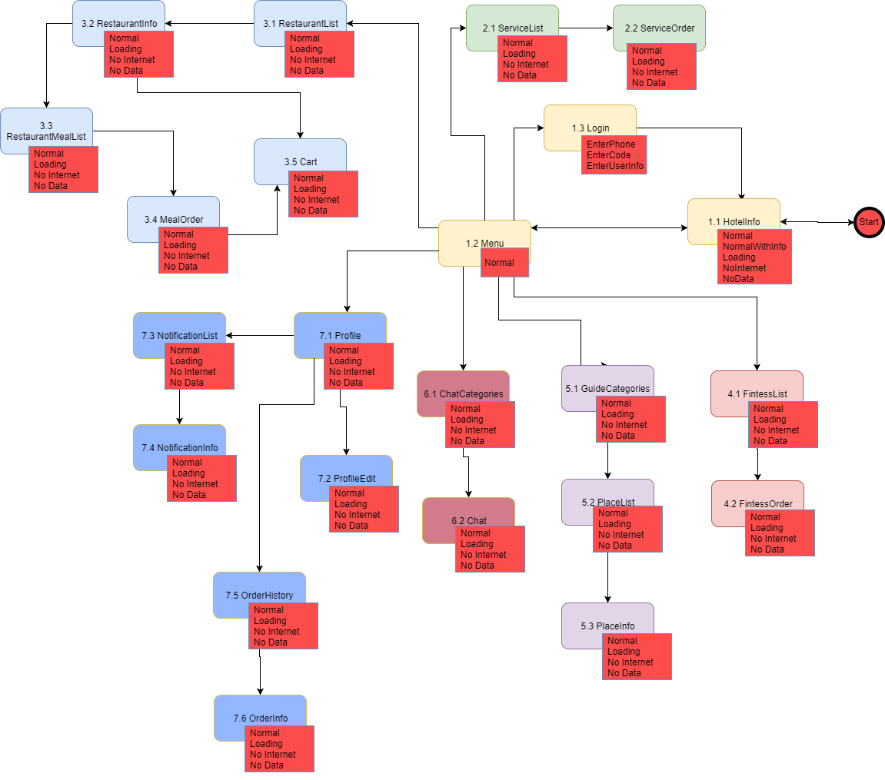

### Order King architecture demo for Xamarin.Forms ###

Commit history to reproduce Xamarin Day demo

Step 1. Create blank project   
Step 1.5. Add infrastructure and base classes  
Step 2. Add ALL empty Pages and ViewModels
Step 3. Add transition between pages  
Step 4. Add DAL base

Here is a screen map we used as a base for implementing project structure  

